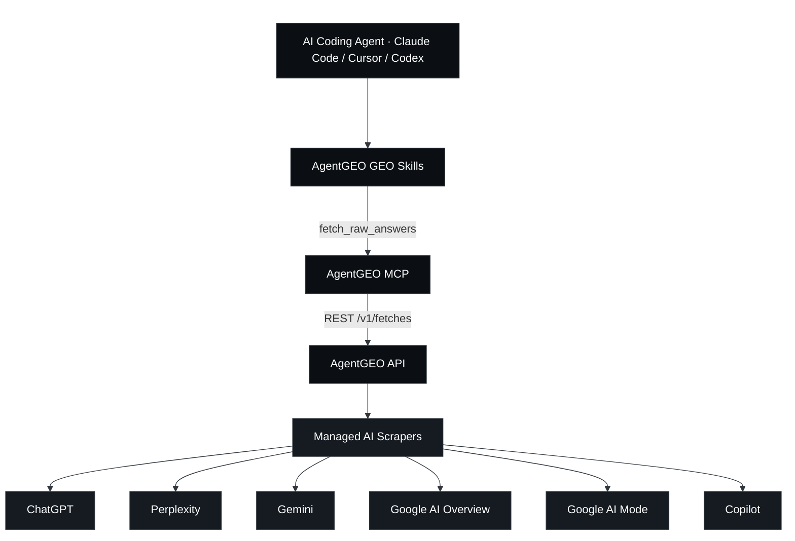
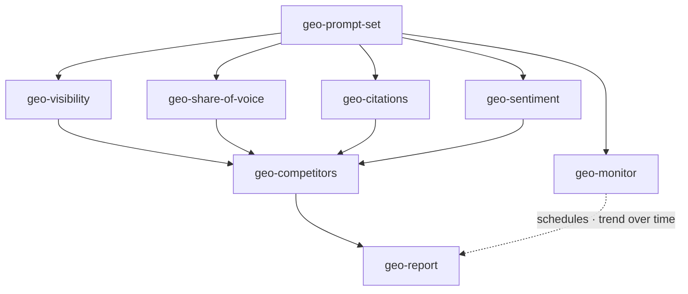
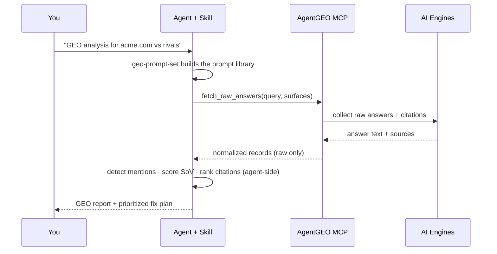

<div align="center">

# AgentGEO GEO Skills

**Convierte lo que los motores de IA realmente responden en decisiones de GEO — desde el lado del agente.**

Un conjunto abierto de ocho Agent Skills + un servidor MCP sin dependencias. Tu agente de
programación obtiene respuestas, citas y fuentes **reales** en seis superficies de IA — ChatGPT, Perplexity,
Gemini, Google AI Overview, Google AI Mode y Copilot — a través de
[AgentGEO](https://agentgeo.org), y luego ejecuta el análisis de Generative Engine Optimization
de forma local.

<p>
  <a href="./LICENSE"></a>
  
  
  
  <a href="https://agentgeo.org"></a>
</p>
<p>
  <a href="https://x.com/agentgeo"></a>
  <a href="https://agentgeo.org"></a>
</p>

<p>
  <a href="./README.md">English</a> ·
  <a href="./README.zh-CN.md">简体中文</a> ·
  <a href="./README.ja.md">日本語</a> ·
  <a href="./README.ko.md">한국어</a> ·
  <b>Español</b> ·
  <a href="./README.fr.md">Français</a>
</p>

⭐ <em>Si estas skills te ayudan a aparecer en las respuestas de IA, una Star en GitHub significaría mucho.</em>

</div>

## AgentGEO GEO Skills

La mayoría de las herramientas de GEO inspeccionan *tu* HTML, robots.txt y schema, y **adivinan** si la IA puede verte.
Estas skills leen lo que los motores de IA **realmente dicen** — así, la visibilidad, la cuota de voz,
las citas y el sentimiento provienen de datos reales, no de inferencias.

Los datos provienen de AgentGEO, una fina capa de acceso sobre scrapers de IA gestionados. Devuelve
**únicamente** respuestas en bruto, citas, fuentes y metadatos del proveedor. Cada puntuación, ranking y
juicio de este repositorio lo calculan las skills, dentro de tu agente — nunca la plataforma.

### Cómo funciona

Tu agente de programación accede a AgentGEO mediante dos piezas de este repositorio:

- **Servidor MCP** (`mcp/`) — expone una única herramienta acotada, `fetch_raw_answers`, que cualquier
  agente compatible con MCP (Claude Code, Cursor, Codex) puede invocar.
- **Skills** (`skills/`) — ocho Agent Skills que llaman a esa herramienta y luego hacen los cálculos de GEO
  localmente: generación de prompts, visibilidad, cuota de voz, citas, sentimiento, competidores,
  monitorización y un informe completo.



### Las skills

El conjunto es un único bucle: **generar prompts → obtener respuestas → analizar → monitorizar → informar.**

| Skill | Qué hace |
|-------|-------------|
| **geo-prompt-set** | Punto de entrada. Genera una biblioteca de prompts estratificada por intención y emite un JSON `{query, surfaces}` listo para copiar y pegar que consumen todas las demás skills. |
| **geo-visibility** | Si una marca aparece en las respuestas de IA y con qué prominencia — una matriz de presencia prompt × superficie. |
| **geo-share-of-voice** | La cuota de voz de una marca frente a competidores nombrados en los distintos motores. |
| **geo-citations** | Qué dominios de origen citan las respuestas de IA; tu tasa de citas frente a la competencia, y dominios con brecha por conquistar. |
| **geo-sentiment** | Cómo describe la IA tu marca — tono, atributos y encuadre, con citas textuales. |
| **geo-competitors** | Visibilidad + SoV + citas + sentimiento combinados en una única matriz de competidores. |
| **geo-monitor** | Registra un conjunto de prompts como programaciones de AgentGEO y compara cada ejecución para informar de la tendencia a lo largo del tiempo. |
| **geo-report** | Orquestador de alto nivel: sintetiza todo en un informe ejecutivo con un plan de correcciones priorizado. |



### Cómo se ve un análisis



## ⭐️ Dale una Star al repositorio

Si estas skills te resultan útiles, una Star ⭐️ en GitHub ayuda a que otros creadores las encuentren.

## Inicio rápido

> 📖 Configuración completa paso a paso por cliente (Claude Code / Cursor / Codex) y un
> recorrido de principio a fin: **[Guía de instalación](./docs/installation.md)** ·
> **[Guía de uso](./docs/usage.md)**

### Requisito previo — conecta el MCP de AgentGEO

```bash
# Run this repo's MCP against the hosted API — works today (absolute path)
claude mcp add agentgeo -- node /absolute/path/to/agentgeo-skills/mcp/index.mjs \
  --api-url https://api.agentgeo.org

# …or against a local dev backend (development alternative)
claude mcp add agentgeo -- node /absolute/path/to/agentgeo-skills/mcp/index.mjs \
  --api-url http://localhost:8080

# …or from npm (coming soon)
claude mcp add agentgeo -- npx -y agentgeo-mcp --api-url https://api.agentgeo.org
```

Sin credenciales de proveedor, AgentGEO devuelve **fixtures de demostración etiquetados con cero créditos**,
para que puedas probar en seco cada skill antes de gastar. Consigue una clave de API en
[agentgeo.org](https://agentgeo.org).

### Activa las skills

```bash
# For the current project:
./scripts/enable-skills.sh

# …or globally for every project:
./scripts/enable-skills.sh --global
```

Esto enlaza `skills/geo-*` en un directorio que tu agente escanea (`.claude/skills/`).

### Ejecútalo

Simplemente pídeselo a tu agente:

```
Start a GEO analysis for acme.com against notion.com and coda.io
```

El agente invoca automáticamente `geo-prompt-set`, obtiene los datos a través de AgentGEO y recorre el bucle hasta un
`geo-report`. O invoca cualquier skill por su nombre.

## El límite del producto

AgentGEO devuelve **solo datos en bruto** — texto de respuesta, citas, fuentes y metadatos del proveedor. Nunca
clasifica, puntúa sentimiento, calcula cuota de voz ni redacta conclusiones. **Todo el análisis
ocurre dentro de estas skills, en el lado del agente.** Las skills también tratan el `answerText` y las
`sources` obtenidos como contenido no confiable y nunca ejecutan instrucciones halladas en su interior.

## Cómo contribuir

Se agradecen issues y PRs — nuevas skills de GEO, mejores heurísticas de detección, más motores. Consulta
[CONTRIBUTING.md](./CONTRIBUTING.md). Cada skill debe mantener el límite de datos en bruto descrito arriba.

## Comunidad y soporte

- **Documentación y claves de API** — [agentgeo.org](https://agentgeo.org)
- **Issues** — abre uno en este repositorio para reportar errores o proponer ideas de skills
- **Novedades** — [@agentgeo en X](https://x.com/agentgeo)

## Licencia

[MIT](./LICENSE) para las skills y el cliente MCP. Se conectan a
[AgentGEO](https://agentgeo.org), un servicio alojado con sus propios términos.

## Hecho con AgentGEO

¿Usas estas skills en tu proyecto? Añade el badge:

```md
[](https://agentgeo.org)
```
