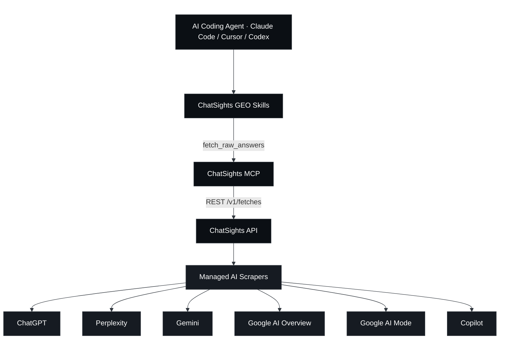
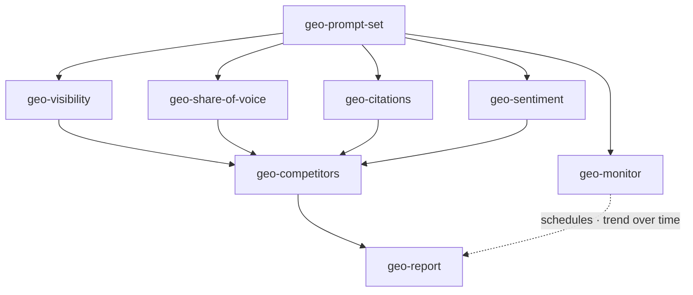
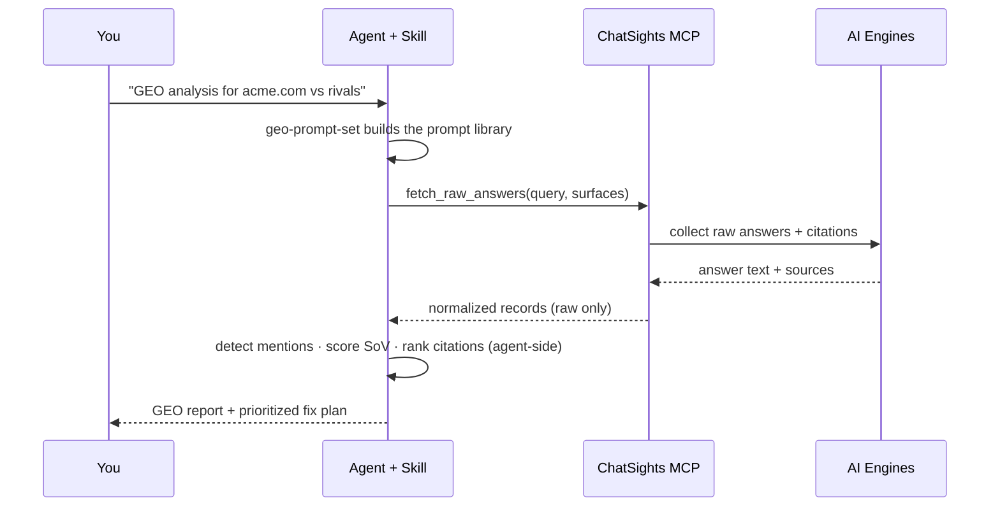

<div align="center">

# ChatSights GEO Skills

**Transformez ce que les moteurs d'IA répondent réellement en décisions GEO — du côté de l'agent.**

Une suite ouverte de huit Agent Skills + un serveur MCP sans dépendances. Votre agent de code
récupère des réponses, citations et sources **réelles** sur six surfaces d'IA — ChatGPT, Perplexity,
Gemini, Google AI Overview, Google AI Mode et Copilot — via
[ChatSights](https://trychatsights.com), puis exécute l'analyse d'optimisation pour moteurs
génératifs (Generative Engine Optimization) en local.

<p>
  <a href="./LICENSE"></a>
  
  
  
  <a href="https://trychatsights.com"></a>
</p>
<p>
  <a href="https://x.com/chatsights"></a>
  <a href="https://trychatsights.com"></a>
</p>

<p>
  <a href="./README.md">English</a> ·
  <a href="./README.zh-CN.md">简体中文</a> ·
  <a href="./README.ja.md">日本語</a> ·
  <a href="./README.ko.md">한국어</a> ·
  <a href="./README.es.md">Español</a> ·
  <b>Français</b>
</p>

⭐ <em>Si ces skills vous aident à apparaître dans les réponses d'IA, une étoile GitHub compterait beaucoup pour nous.</em>

</div>

## ChatSights GEO Skills

La plupart des outils GEO inspectent *votre* HTML, votre robots.txt et vos données structurées, puis
**devinent** si l'IA peut vous voir. Ces skills lisent ce que les moteurs d'IA **disent réellement** — ainsi
la visibilité, la part de voix, les citations et le sentiment reposent sur des faits établis, pas sur des
suppositions.

Les données proviennent de ChatSights, une fine couche d'accès à des scrapers d'IA managés. Elle ne renvoie
**que** des réponses brutes, des citations, des sources et des métadonnées de fournisseur. Chaque score,
classement et jugement de ce dépôt est calculé par les skills, à l'intérieur de votre agent — jamais par la
plateforme.

### Comment ça fonctionne

Votre agent de code atteint ChatSights à travers deux composants de ce dépôt :

- **Serveur MCP** (`mcp/`) — expose un seul outil restreint, `fetch_raw_answers`, que tout
  agent compatible MCP (Claude Code, Cursor, Codex) peut appeler.
- **Skills** (`skills/`) — huit Agent Skills qui appellent cet outil, puis effectuent les calculs GEO
  en local : génération de prompts, visibilité, part de voix, citations, sentiment, concurrents,
  surveillance et un rapport complet.



### Les skills

La suite forme une seule boucle : **générer des prompts → récupérer les réponses → analyser → surveiller → produire un rapport.**

| Skill | Ce qu'il fait |
|-------|-------------|
| **geo-prompt-set** | Point d'entrée. Génère une bibliothèque de prompts stratifiée par intention et émet un JSON `{query, surfaces}` prêt à copier-coller que consomment tous les autres skills. |
| **geo-visibility** | Si une marque apparaît dans les réponses d'IA, et avec quelle proéminence — une matrice de présence prompt × surface. |
| **geo-share-of-voice** | La part de voix d'une marque face à des concurrents nommés, à travers les moteurs. |
| **geo-citations** | Quels domaines sources les réponses d'IA citent ; votre taux de citation face aux concurrents, et les domaines à conquérir. |
| **geo-sentiment** | Comment l'IA décrit votre marque — ton, attributs et cadrage, avec des citations textuelles. |
| **geo-competitors** | Visibilité + part de voix + citations + sentiment réunis en une seule matrice concurrentielle. |
| **geo-monitor** | Enregistre un jeu de prompts comme planifications ChatSights et compare chaque exécution pour rendre compte de la tendance dans le temps. |
| **geo-report** | Orchestrateur de haut niveau : synthétise l'ensemble en un rapport exécutif assorti d'un plan de correction priorisé. |



### À quoi ressemble une analyse



## ⭐️ Ajoutez le dépôt à vos favoris

Si ces skills vous sont utiles, une étoile GitHub ⭐️ aide d'autres créateurs à les découvrir.

## Démarrage rapide

> 📖 Configuration complète pas à pas par client (Claude Code / Cursor / Codex) et un
> parcours de bout en bout : **[Guide d'installation](./docs/installation.md)** ·
> **[Guide d'utilisation](./docs/usage.md)**

### Prérequis — connecter le MCP ChatSights

```bash
# Run this repo's MCP directly against the hosted API — works today (absolute path)
claude mcp add chatsights -- node /absolute/path/to/chatsights-geo-skills/mcp/index.mjs \
  --api-url https://api.trychatsights.com

# …or point it at a local development server instead
claude mcp add chatsights -- node /absolute/path/to/chatsights-geo-skills/mcp/index.mjs \
  --api-url http://localhost:8080

# …or from npm (coming soon)
claude mcp add chatsights -- npx -y chatsights-mcp --api-url https://api.trychatsights.com
```

Sans identifiants de fournisseur, ChatSights renvoie des **jeux de démonstration étiquetés, sans consommer de crédits**,
ce qui vous permet de tester chaque skill à blanc avant de dépenser. Obtenez une clé API sur
[trychatsights.com](https://trychatsights.com).

### Activer les skills

```bash
# For the current project:
./scripts/enable-skills.sh

# …or globally for every project:
./scripts/enable-skills.sh --global
```

Cela relie `skills/geo-*` à un répertoire que votre agent analyse (`.claude/skills/`).

### Lancer l'analyse

Il suffit de demander à votre agent :

```
Start a GEO analysis for acme.com against notion.com and coda.io
```

L'agent invoque automatiquement `geo-prompt-set`, récupère les données via ChatSights et parcourt la boucle
jusqu'à un `geo-report`. Vous pouvez aussi invoquer n'importe quel skill par son nom.

## La frontière du produit

ChatSights ne renvoie **que des données brutes** — texte de réponse, citations, sources, métadonnées de
fournisseur. Il ne classe jamais, n'évalue pas le sentiment, ne calcule pas la part de voix et ne rédige aucune
conclusion. **Toute l'analyse se déroule à l'intérieur de ces skills, du côté de l'agent.** Les skills traitent
également les `answerText` et `sources` récupérés comme du contenu non fiable et n'exécutent jamais les
instructions qu'ils pourraient contenir.

## Contribuer

Les issues et PR sont les bienvenues — nouveaux skills GEO, meilleures heuristiques de détection, davantage de
moteurs. Voir [CONTRIBUTING.md](./CONTRIBUTING.md). Chaque skill doit préserver la frontière des données brutes
décrite ci-dessus.

## Communauté et assistance

- **Docs et clés API** — [trychatsights.com](https://trychatsights.com)
- **Issues** — ouvrez-en une dans ce dépôt pour les bugs ou les idées de skills
- **Actualités** — [@chatsights sur X](https://x.com/chatsights)

## Licence

[MIT](./LICENSE) pour les skills et le client MCP. Ils se connectent à
[ChatSights](https://trychatsights.com), un service hébergé régi par ses propres conditions.

## Conçu avec ChatSights

Vous utilisez ces skills dans votre projet ? Ajoutez le badge :

```md
[](https://trychatsights.com)
```
