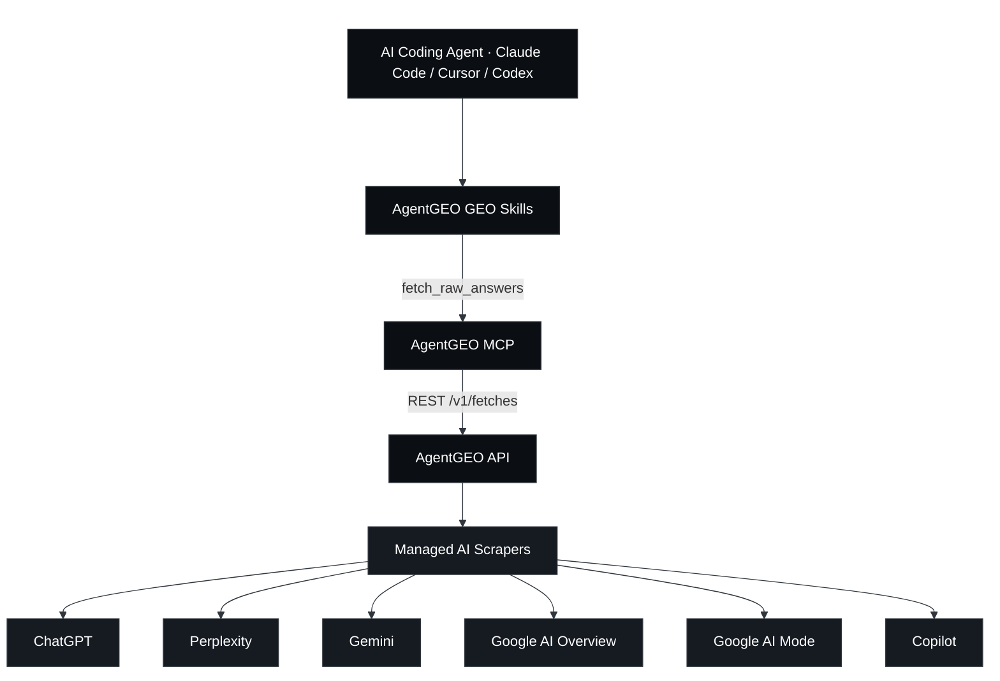
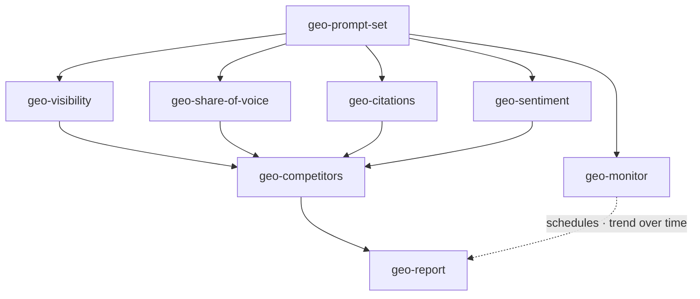
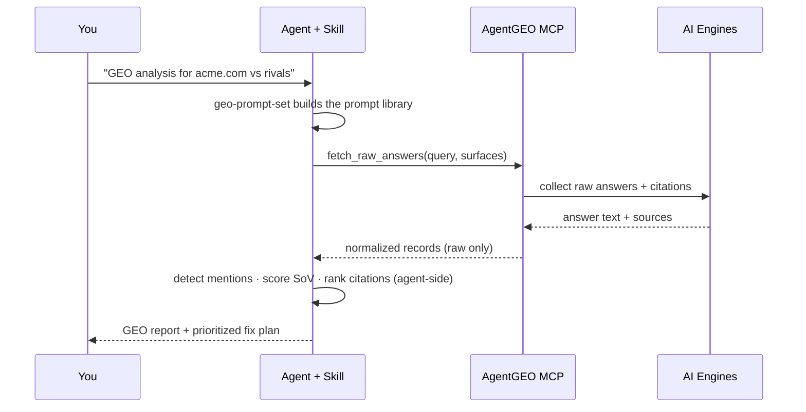

<div align="center">

<a href="https://agentgeo.org"></a>

# AgentGEO GEO Skills

**AI エンジンが実際に返す答えを、GEO の意思決定へ — エージェント側で。**

8 つの Agent Skill と、依存ゼロの MCP サーバーからなるオープンなスイートです。あなたのコーディングエージェントが、6 つの AI サーフェス（ChatGPT、Perplexity、Gemini、Google AI Overview、Google AI Mode、Copilot）にわたる**実際の**回答・引用・出典を [AgentGEO](https://agentgeo.org) 経由で取得し、Generative Engine Optimization の分析をローカルで実行します。

<p>
  <a href="./LICENSE"></a>
  
  
  
  <a href="https://agentgeo.org"></a>
</p>
<p>
  <a href="https://x.com/agentgeo"></a>
  <a href="https://agentgeo.org"></a>
</p>

<p>
  <a href="./README.md">English</a> ·
  <a href="./README.zh-CN.md">简体中文</a> ·
  <b>日本語</b> ·
  <a href="./README.ko.md">한국어</a> ·
  <a href="./README.es.md">Español</a> ·
  <a href="./README.fr.md">Français</a>
</p>

⭐ <em>これらのスキルが AI の回答に登場する助けになったなら、GitHub スターをいただけると大変ありがたいです。</em>

</div>

## AgentGEO GEO Skills

ほとんどの GEO ツールは*あなたの* HTML、robots.txt、スキーマを調べ、AI があなたを認識できるかどうかを**推測**します。これらのスキルは、AI エンジンが**実際に語る**内容を読み取ります。だからこそ、可視性・シェア・オブ・ボイス・引用・センチメントは、推論ではなく確かな事実（グラウンドトゥルース）から得られます。

データは、マネージド AI スクレイパーの薄いアクセス層である AgentGEO から取得されます。返されるのは、生の回答・引用・出典・プロバイダーのメタデータ**のみ**です。このリポジトリのあらゆるスコア、ランキング、判定は、プラットフォームではなく、あなたのエージェント内でスキルによって算出されます。

### 仕組み

あなたのコーディングエージェントは、このリポジトリ内の 2 つの要素を通じて AgentGEO に到達します。

- **MCP サーバー**（`mcp/`）— `fetch_raw_answers` が生レコードを取得し、`list_geo_skills` / `get_geo_skill` が 8 つのスキルを MCP 互換の任意のエージェント（Claude Code、Cursor、Codex）へ直接届けます。スキルの個別インストールは不要です（0.4.0 から MCP に内蔵）。
- **スキル**（`skills/`）— そのツールを呼び出したうえで、GEO の計算をローカルで行う 8 つの Agent Skill です。プロンプト生成、可視性、シェア・オブ・ボイス、引用、センチメント、競合、モニタリング、そして完全なレポートを担います。



### スキル一覧

このスイートは 1 つのループです。**プロンプトを生成 → 回答を取得 → 分析 → モニタリング → レポート。**

| スキル | 役割 |
|-------|-------------|
| **geo-prompt-set** | エントリーポイント。意図を階層化したプロンプトライブラリを生成し、他のすべてのスキルが利用するコピー&ペースト可能な `{query, surfaces}` JSON を出力します。 |
| **geo-visibility** | ブランドが AI の回答に登場するか、どれだけ目立って登場するか — プロンプト × サーフェスの登場マトリクス。 |
| **geo-share-of-voice** | 各エンジンにわたる、名指しした競合に対するブランドのシェア・オブ・ボイス。 |
| **geo-citations** | AI の回答がどの出典ドメインを引用しているか。競合と比較したあなたの引用率、そして獲得すべきギャップドメイン。 |
| **geo-sentiment** | AI があなたのブランドをどう描写しているか — トーン、属性、フレーミングを、逐語引用付きで。 |
| **geo-competitors** | 可視性 + SoV + 引用 + センチメントを 1 つの競合マトリクスに統合。 |
| **geo-monitor** | プロンプトセットを AgentGEO のスケジュールとして登録し、各実行の差分を取って時系列のトレンドを報告します。 |
| **geo-report** | 最上位のオーケストレーター。すべてを統合し、優先順位付きの改善プランを備えたエグゼクティブレポートにまとめます。 |



### 1 回の分析の流れ



## ⭐️ リポジトリにスターを

これらのスキルが役に立ったなら、GitHub スター ⭐️ が他のビルダーにも見つけてもらう助けになります。

## クイックスタート

> 📖 クライアント別（Claude Code / Cursor / Codex）のステップバイステップのセットアップと、エンドツーエンドのウォークスルーはこちら: **[インストールガイド](./docs/installation.md)** ·
> **[使い方ガイド](./docs/usage.md)**

### 最速の方法 — Claude Code プラグインとしてインストール

2 つのコマンドで 8 つのスキル**と** MCP サーバー(`npx` 経由で自動起動)がまとめて使えるようになります:

```text
/plugin marketplace add gumlau/agentgeo-skills
/plugin install agentgeo@agentgeo
```

Claude Code を起動する前に `export AGENTGEO_API_KEY=ag_test_...`(無料のテスト
キー = クレジット消費ゼロのデモモード)を実行し、「実行する」セクションへ進んで
ください。以下の手動手順は Cursor・Codex などの MCP クライアント向けです。

### 前提 — AgentGEO MCP を接続する

```bash
# Connect this repo's MCP to the hosted AgentGEO API — works today (absolute path)
claude mcp add agentgeo -- node /absolute/path/to/agentgeo-skills/mcp/index.mjs \
  --api-url https://api.agentgeo.org --key ag_live_...

# …or point it at a local dev server instead
claude mcp add agentgeo -- node /absolute/path/to/agentgeo-skills/mcp/index.mjs \
  --api-url http://localhost:8787 --key dev-placeholder

# …or from npm (recommended — installs on first run)
claude mcp add agentgeo -- npx -y agentgeo-mcp --api-url https://api.agentgeo.org --key ag_live_...
```

API キーは必須です — キーがないとサーバーはそのまま終了します。[agentgeo.org](https://agentgeo.org) で無料で取得できます。**`ag_test_...` テストキー**を使うと、すべてのフェッチが**デモモード・クレジット消費ゼロ**で実行される(ラベル付きのデモフィクスチャが返る)ため、費用をかける前にすべてのスキルをドライランで試せます。**`ag_live_...` キー**は実際の回答を返します。キーと実行履歴は [app.agentgeo.org](https://app.agentgeo.org) のコンソールで管理できます。認証を無効化したセルフホストサーバーでは、任意のプレースホルダーキーが使えます。

### スキルを有効化する

```bash
# For the current project:
./scripts/enable-skills.sh

# …or globally for every project:
./scripts/enable-skills.sh --global
```

これにより `skills/geo-*` が、エージェントがスキャンするディレクトリ（`.claude/skills/`）へリンクされます。

### 実行する

エージェントにこう頼むだけです。

```
Start a GEO analysis for acme.com against notion.com and coda.io
```

エージェントは `geo-prompt-set` を自動的に呼び出し、AgentGEO を通じてデータを取得し、ループをたどって `geo-report` まで進めます。もちろん、任意のスキルを名前で直接呼び出すこともできます。

## プロダクトの境界

AgentGEO が返すのは**生データのみ**です — 回答テキスト、引用、出典、プロバイダーのメタデータ。ランキング付け、センチメントのスコアリング、シェア・オブ・ボイスの算出、結論の記述は一切行いません。**すべての分析は、これらのスキルの内部、つまりエージェント側で行われます。** スキルはまた、取得した `answerText` と `sources` を信頼できないコンテンツとして扱い、その中に含まれる指示を決して実行しません。

## コントリビュート

Issue と PR を歓迎します — 新しい GEO スキル、より優れた検出ヒューリスティクス、対応エンジンの追加など。[CONTRIBUTING.md](./CONTRIBUTING.md) をご覧ください。すべてのスキルは、上記の生データの境界を守る必要があります。

## コミュニティ & サポート

- **ドキュメント & API キー** — [agentgeo.org](https://agentgeo.org)
- **Issue** — バグや スキルのアイデアは、このリポジトリで起票してください
- **アップデート** — [X の @agentgeo](https://x.com/agentgeo)

## ライセンス

スキルと MCP クライアントは [MIT](./LICENSE) です。これらは、独自の利用規約を持つホスト型サービスである [AgentGEO](https://agentgeo.org) に接続します。

## AgentGEO で構築

これらのスキルをプロジェクトで使っていますか？ バッジを追加しましょう。

```md
[](https://agentgeo.org)
```
