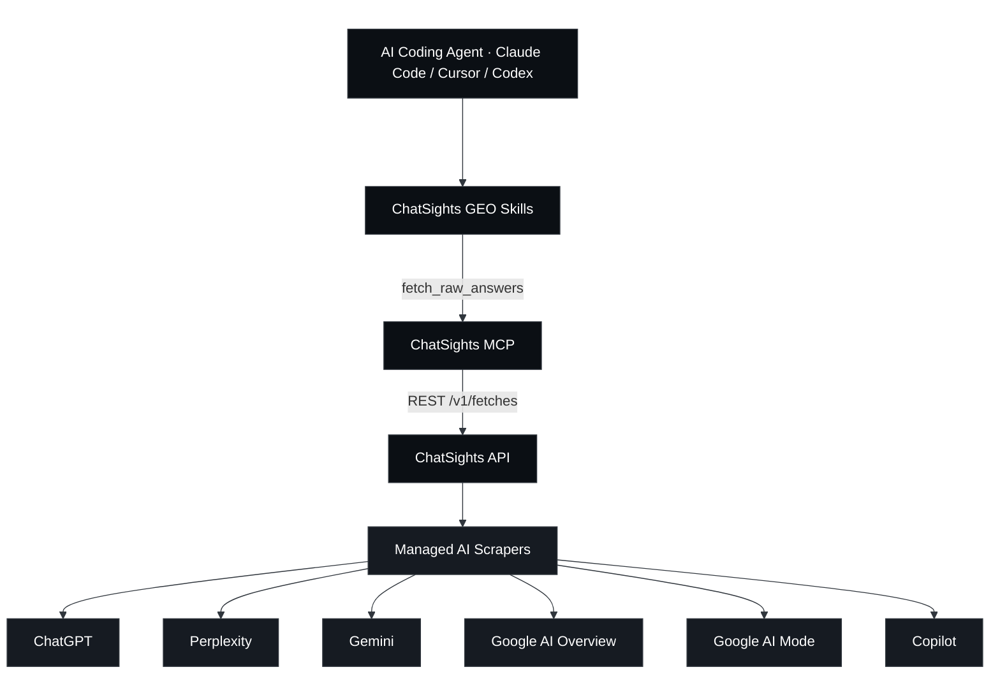
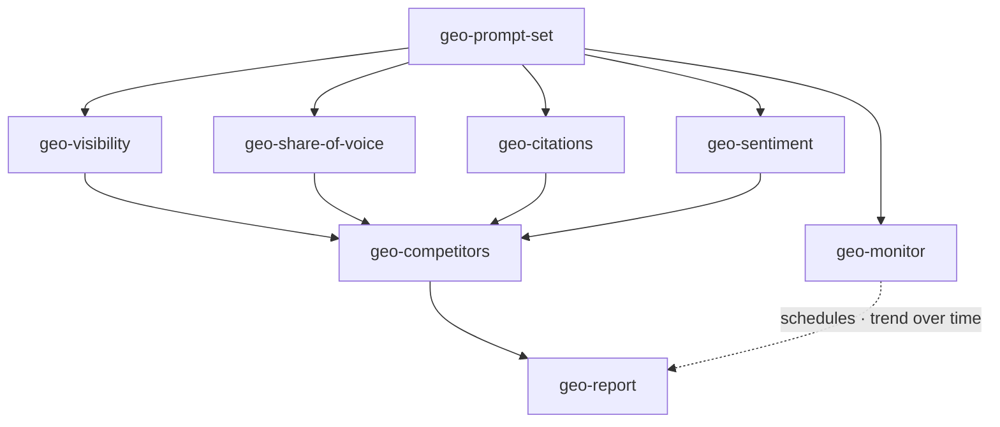
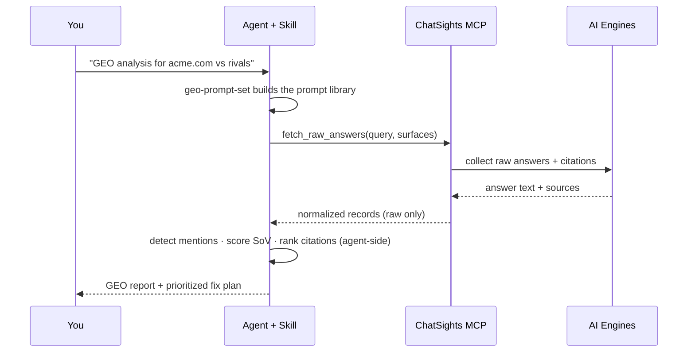

<div align="center">

# ChatSights GEO Skills

**AI 엔진이 실제로 답변하는 내용을 GEO 의사결정으로 바꾸세요 — 에이전트 측에서.**

여덟 개의 Agent Skills와 의존성 없는 MCP 서버로 구성된 오픈 스위트입니다. 코딩 에이전트가
[ChatSights](https://trychatsights.com)를 통해 여섯 개의 AI 표면 — ChatGPT, Perplexity,
Gemini, Google AI Overview, Google AI Mode, Copilot — 전반에서 **실제** 답변, 인용, 출처를
가져온 뒤, 생성형 엔진 최적화(Generative Engine Optimization) 분석을 로컬에서 수행합니다.

<p>
  <a href="./LICENSE"></a>
  
  
  
  <a href="https://trychatsights.com"></a>
</p>
<p>
  <a href="https://x.com/chatsights"></a>
  <a href="https://trychatsights.com"></a>
</p>

<p>
  <a href="./README.md">English</a> ·
  <a href="./README.zh-CN.md">简体中文</a> ·
  <a href="./README.ja.md">日本語</a> ·
  <b>한국어</b> ·
  <a href="./README.es.md">Español</a> ·
  <a href="./README.fr.md">Français</a>
</p>

⭐ <em>이 스킬들이 AI 답변에 여러분을 노출시키는 데 도움이 되었다면, GitHub Star를 눌러주시면 큰 힘이 됩니다.</em>

</div>

## ChatSights GEO Skills

대부분의 GEO 도구는 *여러분의* HTML, robots.txt, 스키마를 검사하고 AI가 여러분을 볼 수 있는지를
**추측**합니다. 이 스킬들은 AI 엔진이 **실제로 말하는** 내용을 읽습니다 — 그래서 가시성, 점유율,
인용, 감성이 추론이 아니라 실측 데이터에서 나옵니다.

데이터는 관리형 AI 스크레이퍼 위에 얇게 얹힌 접근 계층인 ChatSights에서 옵니다. ChatSights는
**오직** 원본 답변, 인용, 출처, 제공자 메타데이터만 반환합니다. 이 저장소의 모든 점수, 순위, 판단은
스킬이 여러분의 에이전트 내부에서 계산하며 — 플랫폼이 계산하는 일은 결코 없습니다.

### 작동 방식

코딩 에이전트는 이 저장소의 두 요소를 통해 ChatSights에 도달합니다.

- **MCP 서버** (`mcp/`) — 하나의 좁은 도구 `fetch_raw_answers`를 노출하며, MCP 호환
  에이전트(Claude Code, Cursor, Codex)라면 무엇이든 호출할 수 있습니다.
- **Skills** (`skills/`) — 그 도구를 호출한 뒤 GEO 연산을 로컬에서 수행하는 여덟 개의 Agent Skills입니다:
  프롬프트 생성, 가시성, 점유율, 인용, 감성, 경쟁사, 모니터링, 그리고 종합 리포트.



### 스킬 구성

이 스위트는 하나의 루프입니다: **프롬프트 생성 → 답변 가져오기 → 분석 → 모니터링 → 리포트.**

| Skill | 하는 일 |
|-------|-------------|
| **geo-prompt-set** | 진입점. 의도 계층화된 프롬프트 라이브러리를 생성하고, 다른 모든 스킬이 소비하는 복사-붙여넣기 가능한 `{query, surfaces}` JSON을 내보냅니다. |
| **geo-visibility** | 브랜드가 AI 답변에 등장하는지, 얼마나 두드러지게 등장하는지 — 프롬프트 × 표면 노출 매트릭스. |
| **geo-share-of-voice** | 엔진 전반에서 지명된 경쟁사 대비 브랜드의 점유율. |
| **geo-citations** | AI 답변이 어떤 출처 도메인을 인용하는지; 경쟁사 대비 인용률, 그리고 확보해야 할 갭 도메인. |
| **geo-sentiment** | AI가 여러분의 브랜드를 어떻게 묘사하는지 — 어조, 속성, 프레이밍을 원문 인용과 함께. |
| **geo-competitors** | 가시성 + SoV + 인용 + 감성을 하나의 경쟁사 매트릭스로 결합. |
| **geo-monitor** | 프롬프트 세트를 ChatSights 스케줄로 등록하고 실행마다 차이를 비교해 시간에 따른 추세를 리포트합니다. |
| **geo-report** | 최상위 오케스트레이터: 모든 것을 종합해 우선순위가 매겨진 수정 계획이 담긴 임원용 리포트를 작성합니다. |



### 한 번의 분석은 이렇게 진행됩니다



## ⭐️ 저장소에 Star 눌러주기

이 스킬들이 유용하다고 느끼셨다면, GitHub Star ⭐️는 다른 빌더들이 이 스킬들을 찾는 데 도움이 됩니다.

## 빠른 시작

> 📖 클라이언트별(Claude Code / Cursor / Codex) 단계별 전체 설정과 엔드투엔드
> 워크스루: **[설치 가이드](./docs/installation.md)** ·
> **[사용 가이드](./docs/usage.md)**

### 사전 준비 — ChatSights MCP 연결

```bash
# Connect this repo's MCP to the hosted API — works today (absolute path)
claude mcp add chatsights -- node /absolute/path/to/chatsights-geo-skills/mcp/index.mjs \
  --api-url https://api.trychatsights.com

# …or for local development, point at a locally running API instead
claude mcp add chatsights -- node /absolute/path/to/chatsights-geo-skills/mcp/index.mjs \
  --api-url http://localhost:8080

# …or from npm (coming soon)
claude mcp add chatsights -- npx -y chatsights-mcp --api-url https://api.trychatsights.com
```

제공자 자격 증명이 없어도 ChatSights는 라벨이 붙은 **데모 픽스처를 크레딧 소모 없이** 반환하므로,
비용을 쓰기 전에 모든 스킬을 드라이런할 수 있습니다. API 키는
[trychatsights.com](https://trychatsights.com)에서 받으세요.

### 스킬 활성화

```bash
# For the current project:
./scripts/enable-skills.sh

# …or globally for every project:
./scripts/enable-skills.sh --global
```

이 명령은 `skills/geo-*`를 에이전트가 스캔하는 디렉터리(`.claude/skills/`)에 링크합니다.

### 실행하기

에이전트에게 이렇게 요청하기만 하면 됩니다:

```
Start a GEO analysis for acme.com against notion.com and coda.io
```

에이전트는 `geo-prompt-set`을 자동으로 호출하고, ChatSights를 통해 데이터를 가져온 뒤,
루프를 따라 `geo-report`까지 진행합니다. 또는 원하는 스킬을 이름으로 직접 호출할 수도 있습니다.

## 제품 경계

ChatSights는 **원본 데이터만** 반환합니다 — 답변 텍스트, 인용, 출처, 제공자 메타데이터. 순위를
매기거나, 감성을 채점하거나, 점유율을 계산하거나, 결론을 쓰는 일은 결코 하지 않습니다. **모든 분석은
이 스킬들 내부, 에이전트 측에서 이루어집니다.** 또한 스킬들은 가져온 `answerText`와 `sources`를
신뢰할 수 없는 콘텐츠로 취급하며, 그 안에 담긴 지시를 절대 실행하지 않습니다.

## 기여하기

이슈와 PR을 환영합니다 — 새로운 GEO 스킬, 더 나은 탐지 휴리스틱, 더 많은 엔진. 자세한 내용은
[CONTRIBUTING.md](./CONTRIBUTING.md)를 참고하세요. 모든 스킬은 위의 원본 데이터 경계를 반드시 지켜야 합니다.

## 커뮤니티 & 지원

- **문서 & API 키** — [trychatsights.com](https://trychatsights.com)
- **이슈** — 버그나 스킬 아이디어는 이 저장소에 이슈로 등록하세요
- **업데이트** — [X의 @chatsights](https://x.com/chatsights)

## 라이선스

스킬과 MCP 클라이언트는 [MIT](./LICENSE)입니다. 이들은 자체 약관을 가진 호스팅 서비스인
[ChatSights](https://trychatsights.com)에 연결됩니다.

## ChatSights로 제작됨

프로젝트에서 이 스킬들을 사용하고 계신가요? 배지를 추가하세요:

```md
[](https://trychatsights.com)
```
