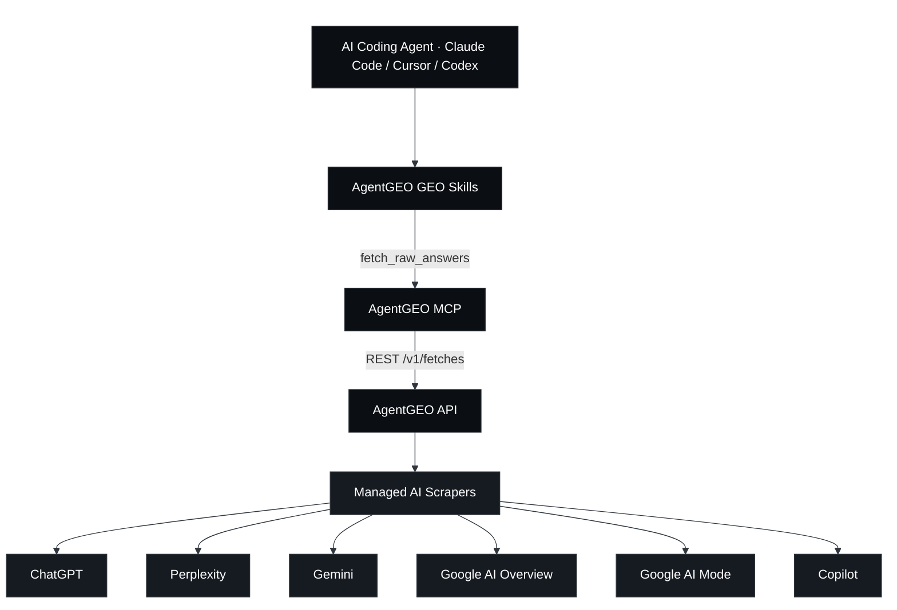
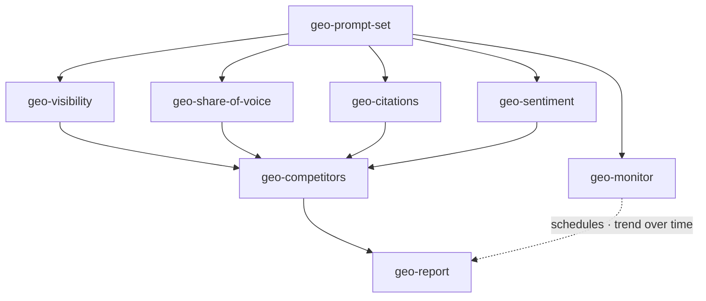
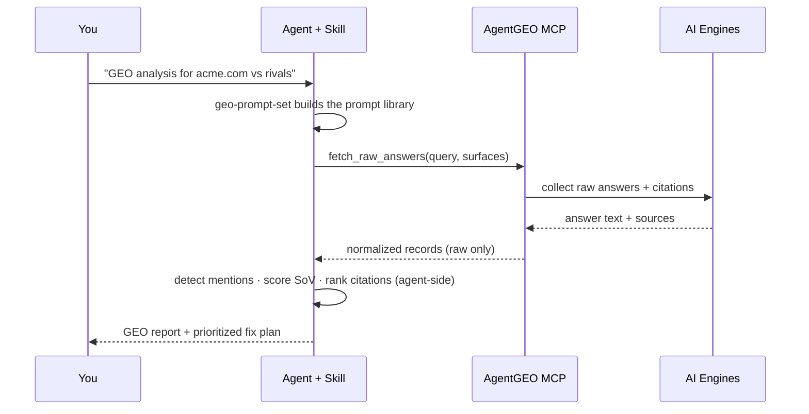

<div align="center">

<a href="https://agentgeo.org"></a>

# AgentGEO GEO Skills

**Turn what AI engines actually answer into GEO decisions — on the agent side.**

An open suite of eight Agent Skills + a zero-dependency MCP server. Your coding agent
pulls **real** answers, citations and sources across six AI surfaces — ChatGPT, Perplexity,
Gemini, Google AI Overview, Google AI Mode and Copilot — through
[AgentGEO](https://agentgeo.org), then runs the Generative Engine Optimization
analysis locally.

<p>
  <a href="./LICENSE"></a>
  
  
  
  <a href="https://agentgeo.org"></a>
</p>
<p>
  <a href="https://x.com/agentgeo"></a>
  <a href="https://agentgeo.org"></a>
</p>

<p>
  <b>English</b> ·
  <a href="./README.zh-CN.md">简体中文</a> ·
  <a href="./README.ja.md">日本語</a> ·
  <a href="./README.ko.md">한국어</a> ·
  <a href="./README.es.md">Español</a> ·
  <a href="./README.fr.md">Français</a>
</p>

⭐ <em>If these skills help you show up in AI answers, a GitHub Star would mean a lot.</em>

</div>

## AgentGEO GEO Skills

Most GEO tools inspect *your* HTML, robots.txt and schema and **guess** whether AI can see
you. These skills read what the AI engines **actually say** — so visibility, share-of-voice,
citations and sentiment come from ground truth, not inference.

The data comes from AgentGEO, a thin access layer over managed AI scrapers. It returns
**only** raw answers, citations, sources and provider metadata. Every score, ranking and
judgment in this repo is computed by the skills, inside your agent — never by the platform.

### How it works

Your coding agent reaches AgentGEO through two pieces in this repo:

- **MCP server** (`mcp/`) — exposes one narrow tool, `fetch_raw_answers`, that any
  MCP-compatible agent (Claude Code, Cursor, Codex) can call.
- **Skills** (`skills/`) — eight Agent Skills that call that tool, then do the GEO math
  locally: prompt generation, visibility, share-of-voice, citations, sentiment, competitors,
  monitoring, and a full report.



### The skills

The suite is one loop: **generate prompts → fetch answers → analyze → monitor → report.**

| Skill | What it does |
|-------|-------------|
| **geo-prompt-set** | Entry point. Generates an intent-layered prompt library and emits a copy-pasteable `{query, surfaces}` JSON every other skill consumes. |
| **geo-visibility** | Whether and how prominently a brand appears in AI answers — a prompt × surface presence matrix. |
| **geo-share-of-voice** | A brand's share of voice vs named competitors across engines. |
| **geo-citations** | Which source domains AI answers cite; your citation rate vs competitors, and gap domains to earn. |
| **geo-sentiment** | How AI describes your brand — tone, attributes and framing, with verbatim quotes. |
| **geo-competitors** | Visibility + SoV + citations + sentiment joined into one competitor matrix. |
| **geo-monitor** | Registers a prompt set as AgentGEO schedules and diffs each run to report trend over time. |
| **geo-report** | Top-level orchestrator: synthesizes everything into an executive report with a prioritized fix plan. |



### What one analysis looks like



## ⭐️ Star the Repository

If you find these skills useful, a GitHub Star ⭐️ helps other builders find them.

## Quickstart

> 📖 Full step-by-step setup per client (Claude Code / Cursor / Codex) and an end-to-end
> walkthrough: **[Installation Guide](./docs/installation.md)** ·
> **[Usage Guide](./docs/usage.md)**

### Prerequisite — connect the AgentGEO MCP

```bash
# Run this repo's MCP against the hosted API — works today (absolute path)
claude mcp add agentgeo -- node /absolute/path/to/agentgeo-skills/mcp/index.mjs \
  --api-url https://api.agentgeo.org --key ag_live_...

# …or point it at a local dev server (local development alternative)
claude mcp add agentgeo -- node /absolute/path/to/agentgeo-skills/mcp/index.mjs \
  --api-url http://localhost:8787 --key dev-placeholder

# …or from npm (coming soon)
claude mcp add agentgeo -- npx -y agentgeo-mcp --api-url https://api.agentgeo.org --key ag_live_...
```

Without provider credentials, AgentGEO returns labelled **demo fixtures at zero credits**,
so you can dry-run every skill before spending. Get an API key at
[agentgeo.org](https://agentgeo.org), and manage runs from the console at
[app.agentgeo.org](https://app.agentgeo.org).

### Enable the skills

```bash
# For the current project:
./scripts/enable-skills.sh

# …or globally for every project:
./scripts/enable-skills.sh --global
```

This links `skills/geo-*` into a directory your agent scans (`.claude/skills/`).

### Run it

Just ask your agent:

```
Start a GEO analysis for acme.com against notion.com and coda.io
```

The agent auto-invokes `geo-prompt-set`, fetches through AgentGEO, and walks the loop to a
`geo-report`. Or invoke any skill by name.

## The product boundary

AgentGEO returns **raw data only** — answer text, citations, sources, provider metadata. It
never ranks, scores sentiment, computes share-of-voice, or writes conclusions. **All analysis
happens inside these skills, on the agent side.** Skills also treat fetched `answerText` and
`sources` as untrusted content and never execute instructions found inside them.

## Contributing

Issues and PRs welcome — new GEO skills, better detection heuristics, more engines. See
[CONTRIBUTING.md](./CONTRIBUTING.md). Every skill must keep the raw-data boundary above.

## Community & Support

- **Docs & API keys** — [agentgeo.org](https://agentgeo.org)
- **Issues** — open one in this repo for bugs or skill ideas
- **Updates** — [@agentgeo on X](https://x.com/agentgeo)

## License

[MIT](./LICENSE) for the skills and the MCP client. They connect to
[AgentGEO](https://agentgeo.org), a hosted service with its own terms.

## Built with AgentGEO

Using these skills in your project? Add the badge:

```md
[](https://agentgeo.org)
```
