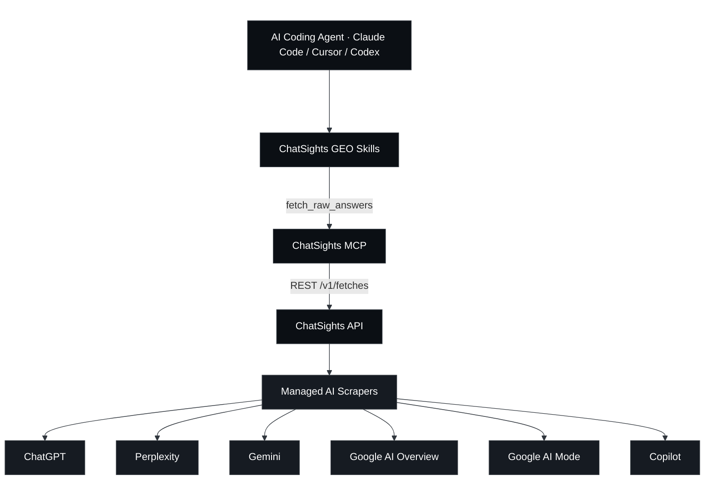
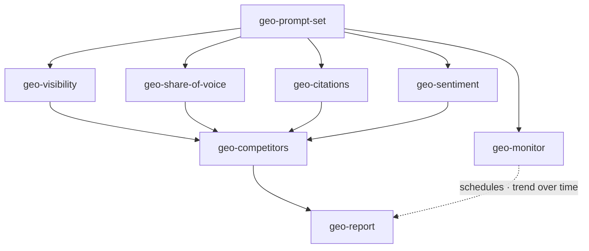
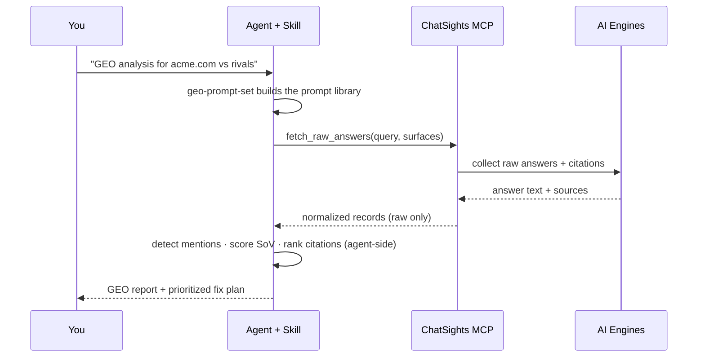

<div align="center">

# ChatSights GEO Skills

**把 AI 引擎真实的回答,变成 GEO 决策 —— 全部在 agent 侧完成。**

一套开源的八个 Agent Skill + 一个零依赖 MCP 服务器。你的编码 agent 通过
[ChatSights](https://trychatsights.com) 跨六个 AI 界面拉取**真实的**答案、引用与来源
—— ChatGPT、Perplexity、Gemini、Google AI Overview、Google AI Mode、Copilot ——
然后在本地完成生成式引擎优化(GEO)分析。

<p>
  <a href="./LICENSE"></a>
  
  
  
  <a href="https://trychatsights.com"></a>
</p>
<p>
  <a href="https://x.com/chatsights"></a>
  <a href="https://trychatsights.com"></a>
</p>

<p>
  <a href="./README.md">English</a> ·
  <b>简体中文</b> ·
  <a href="./README.ja.md">日本語</a> ·
  <a href="./README.ko.md">한국어</a> ·
  <a href="./README.es.md">Español</a> ·
  <a href="./README.fr.md">Français</a>
</p>

⭐ <em>如果这些 skill 帮你出现在 AI 的答案里,给个 GitHub Star 就是最大的鼓励。</em>

</div>

## ChatSights GEO Skills

大多数 GEO 工具检查的是*你自己*的 HTML、robots.txt 和 schema,然后**猜测** AI 能不能看见你。
而这些 skill 读取的是 AI 引擎**真实说出口**的内容 —— 所以可见度、声量占比(share-of-voice)、
引用和情感,全都来自真实数据,而非推断。

数据来自 ChatSights —— 一个架在托管 AI 抓取器之上的轻量访问层。它**只**返回原始答案、引用、
来源和 provider 元数据。本仓库里的每一个分数、排名和判断,都是由 skill 在你的 agent 内部计算的
—— 平台从不代劳。

### 工作原理

你的编码 agent 通过本仓库的两个部分接入 ChatSights:

- **MCP 服务器**(`mcp/`)—— 暴露一个职责单一的工具 `fetch_raw_answers`,任何兼容 MCP 的
  agent(Claude Code、Cursor、Codex)都能调用。
- **Skills**(`skills/`)—— 八个 Agent Skill,调用该工具后在本地完成 GEO 计算:prompt 生成、
  可见度、声量占比、引用、情感、竞品、监控,以及一份完整报告。



### 这套 skill

整套 skill 是一个闭环:**生成 prompt → 拉取答案 → 分析 → 监控 → 报告。**

| Skill | 作用 |
|-------|-------------|
| **geo-prompt-set** | 入口。生成一套按意图分层的 prompt 库,并输出可直接复制的 `{query, surfaces}` JSON,供其余所有 skill 消费。 |
| **geo-visibility** | 品牌是否、以及多显眼地出现在 AI 答案中 —— 一张 prompt × surface 的存在度矩阵。 |
| **geo-share-of-voice** | 品牌相对指定竞品、跨各引擎的声量占比。 |
| **geo-citations** | AI 答案引用了哪些来源域名;你的被引率 vs 竞品,以及值得去争取的"缺口域名"。 |
| **geo-sentiment** | AI 如何描述你的品牌 —— 语气、属性和措辞,附带逐字引用。 |
| **geo-competitors** | 把可见度 + 声量占比 + 引用 + 情感,合并成一张竞品矩阵。 |
| **geo-monitor** | 将一套 prompt 注册为 ChatSights schedule,逐次 diff 以报告随时间的趋势。 |
| **geo-report** | 顶层编排:把上述一切综合成一份高管级报告 + 优先级修复清单。 |



### 一次分析长什么样



## ⭐️ 给仓库点个 Star

如果这些 skill 对你有用,一个 GitHub Star ⭐️ 能帮更多开发者发现它们。

## 快速开始

> 📖 各客户端(Claude Code / Cursor / Codex)的完整分步配置,以及端到端演练:
> **[安装指南](./docs/installation.md)** · **[使用指南](./docs/usage.md)**

### 前置 —— 连接 ChatSights MCP

```bash
# 直接运行本仓库的 MCP —— 现在就能用(绝对路径)
claude mcp add chatsights -- node /absolute/path/to/chatsights-geo-skills/mcp/index.mjs \
  --api-url http://localhost:8080

# …或从 npm 运行(即将上线)
claude mcp add chatsights -- npx -y chatsights-mcp --api-url https://api.trychatsights.com
```

在没有 provider 凭证时,ChatSights 会返回带标注的**演示数据(demo fixtures),零 credit 消耗**,
让你在花钱之前先把每个 skill 跑通。到 [trychatsights.com](https://trychatsights.com) 获取 API key。

### 启用这些 skill

```bash
# 仅当前项目:
./scripts/enable-skills.sh

# …或对所有项目全局启用:
./scripts/enable-skills.sh --global
```

它会把 `skills/geo-*` 软链到你的 agent 会扫描的目录(`.claude/skills/`)。

### 跑起来

直接对你的 agent 说:

```
Start a GEO analysis for acme.com against notion.com and coda.io
```

agent 会自动触发 `geo-prompt-set`,通过 ChatSights 拉取数据,并沿着闭环一路走到
`geo-report`。你也可以按名字调用任意一个 skill。

## 产品边界

ChatSights **只返回原始数据** —— 答案文本、引用、来源、provider 元数据。它从不排名、不打情感分、
不计算声量占比、也不下结论。**所有分析都发生在这些 skill 内部、在 agent 侧完成。** skill 同时把拉取到的
`answerText` 和 `sources` 视为不可信内容,绝不执行其中出现的任何指令。

## 参与贡献

欢迎提 Issue 和 PR —— 新的 GEO skill、更好的检测启发式、更多引擎。见
[CONTRIBUTING.md](./CONTRIBUTING.md)。每个 skill 都必须坚守上面的原始数据边界。

## 社区与支持

- **文档与 API key** —— [trychatsights.com](https://trychatsights.com)
- **Issues** —— 在本仓库提交 bug 或 skill 想法
- **动态** —— [@chatsights on X](https://x.com/chatsights)

## 许可

skill 和 MCP 客户端采用 [MIT](./LICENSE) 许可。它们连接的是
[ChatSights](https://trychatsights.com) —— 一个有自身条款的托管服务。

## Built with ChatSights

在你的项目里用了这些 skill?加上徽章:

```md
[](https://trychatsights.com)
```
